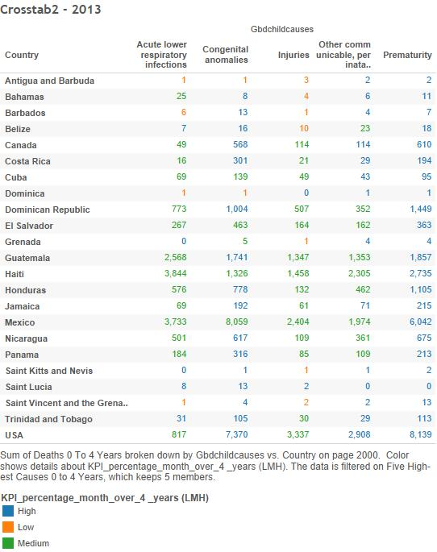
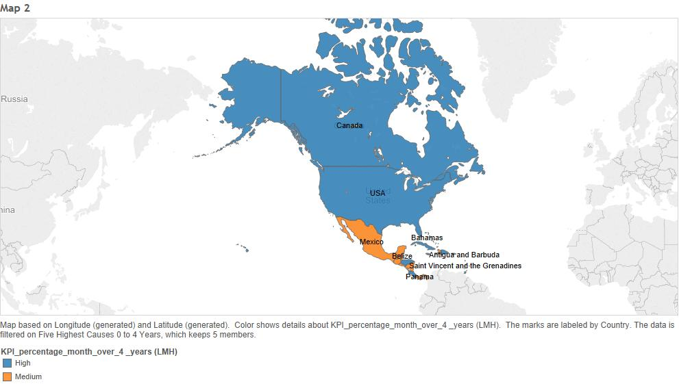

```{r, warning=FALSE, message=FALSE}
require("jsonlite")
require("RCurl")
require("ggplot2")
require("dplyr")
library("shiny")
require("shinydashboard")
require("leaflet")
```

##Our Dataset
To create our dataset, we blended several different datasets.
Each dataset was for a specific country.
Every dataset had the fields Cause of Child Death, Year, Deaths 0-27 Days, Deaths 0-4 years, Deaths 1-59 months.

##Head
```{r, warning=FALSE, message=FALSE}
setwd("~/DataVisualization/DV_FinalProject")

file_path <- "ChildDeaths.reformatted.csv"

df <- read.csv(file_path, stringsAsFactors = FALSE)
View(df)
# Replace "." (i.e., period) with "_" in the column names.
names(df) <- gsub("\\.+", "_", names(df))

head(df)
```

##Summary
```{r, warning=FALSE, message=FALSE}
summary(df)
```

##Extract, Transform, Load
To fix our data so it can be loaded into Oracle correctly, we first replaced the periods in our column rows with underscores. 
```
> names(df) <- gsub("\\.+", "_", names(df))
```
We then, set our measures appropriately:
```
> measures <- c("Year", "Deaths_0_to_27_Days", "Deaths_1_to_59_Months", "Deaths_0_to_4_Years") 
```
We got rid of all special characters in each column:
```
> for(n in names(df)) {
    df[n] <- data.frame(lapply(df[n], gsub, pattern="[^ -~]",replacement= ""))
}
```
We created our dimensions:
```
> dimensions <- setdiff(names(df), measures)
if( length(measures) > 1 || ! is.na(dimensions)) {
  for(d in dimensions) {
    # Get rid of " and ' in dimensions.
    df[d] <- data.frame(lapply(df[d], gsub, pattern="[\"']",replacement= ""))
    # Change & to and in dimensions.
    df[d] <- data.frame(lapply(df[d], gsub, pattern="&",replacement= " and "))
    # Change : to ; in dimensions.
    df[d] <- data.frame(lapply(df[d], gsub, pattern=":",replacement= ";"))
  }
}

library(lubridate)

if( length(measures) > 1 || ! is.na(measures)) {
  for(m in measures) {
    df[m] <- data.frame(lapply(df[m], gsub, pattern="[^--.0-9]",replacement= ""))
  }
}
```

We created our re-formatted csv, then created our SQL concatenation
```
> tableName <- gsub(" +", "_", gsub("[^A-z, 0-9, ]", "", gsub(".csv", "", file_path)))
sql <- paste("CREATE TABLE", tableName, "(\n-- Change table_name to the table name you want.\n")
if( length(measures) > 1 || ! is.na(dimensions)) {
  for(d in dimensions) {
    sql <- paste(sql, paste(d, "varchar2(4000),\n"))
  }
}
if( length(measures) > 1 || ! is.na(measures)) {
  for(m in measures) {
    if(m != tail(measures, n=1)) sql <- paste(sql, paste(m, "number(38,4),\n"))
    else sql <- paste(sql, paste(m, "number(38,4)\n"))
  }
}

sql <- paste(sql, ");")
cat(sql)
```
And pasted it into SQL developer. We ran this script, then imported our reformatted CSV to create the table.

```{r, warning=FALSE, message=FALSE}
source("../ETL.R",echo=FALSE)
```

##Methodology
We followed the methodology learned in class to analyze our data and product interesting visualizations, the most fascinating of which we put into a Shiny App, which can be accessed with this link:
https://zareen.shinyapps.io/FinalProjectApp

##Step 1: Non-Aggregated Measures Analysis

##Boxplot
1. Uncheck "Aggregate Measures" under the "Analysis" tab.
2. Click on "Deaths 0 to 27 Days" under Measures and click on the Boxplot icon under "Show Me."
3. Drag "Gbdchildcauses" onto Columns.
4. Drag "Country" onto the Color Shelf.
5. Select "Circle" under the "Marks" dropdown.
6. Drag "Deaths 0 to 27 Days" onto Filter. Double Click it and write "1" for At Least, which took out Measles and Malaria.


##Step 2: Aggregated Measures Analysis

##Histogram
1. Click on "Deaths 0 to 27 Days" under Measures and then click on the Historgram icon on "Show Me."
2. A "Deaths 0 to 27 Days (bin)" item was created under Dimensions. Open the menu on this item and select "Edit." Change the bin size to 10.
3. Drag "Gbdchildcauses" onto the Pages Shelf.
4. Right click the y-axis side and select "Add Reference Line." Then select "Average" for the 2nd Value dropdown and select "Value" for the Label.
5. Step through each Cause.


##Treemap: Total Deaths
1. 


##Treemap: Deaths by Cause


##Step 3: Scatterplots

##Scatterplot: Causes of Death in Children Ages 0-27 Days Per Year vs. Ages 1-59 Months
1. Uncheck Aggregate Measures under the Analysis.
2. Drag "Year" onto the Column Shelf.
3. Drag "Deaths 0 to 27 Days" and "Deaths 1 to 59 Months" onto the Rows Shelf.
4. Drag "Country" onto Color.
5. Drag the "Five Highest Causes"
set onto Filters. (If you have not made a set yet, which we will go through later, just drag "Gbdchildcauses" into filters and select which ones you would like to include.)
6. Change the dropdown under Marks to "Line."
7. Drag "Gbdchildcauses" to Pages.
8. Step through each cause.


##Scatterplot: Top 5 Causes of Death in Mexico and the U.S.
1. Uncheck Aggregate Measures under the Analysis.
2. Drag "Country" and "Year" onto the Column Shelf.
3. Drag "Deaths 0 to 4 Years" onto the Rows Shelf.
4. Drag "Gbdchildcauses" onto Color.
5. Drag "Country" and the "Five Highest Causes"
set onto Filters. Select only Mexico and USA for "Country." (If you have not made a set yet, which we will go through later, just drag "Gbdchildcauses" into filters and select which ones you would like to include.)
6. Change the dropdown under Marks to "Line."


#Step 4: Crosstab
1. Drag "Gbdchildcauses" onto the Columns Shelf.
2. Drag "Country" onto the Rows Shelf.
3. Drag "Death 0 to 4 Years" to Label.
4. On the Dimensions Tab, click on the menu icon, and select "Create Calculated Field."
9. Name the Calculated Field "KPI_percentage_month_over_4_years."
10. Enter Sum([Deaths 0 to 27 Days])/Sum([Deaths 0 to 4 Years]) as the calculation.
11. Drag the KPI onto Color.
12. Change the Color Pallete to "Red-Blue Diverging."


Follow the same steps as above but drag "Five Highest Causes" set onto Filters.
In addition, create parameters so that your KPI can be displayed as "Low," "Medium," and "High":
1. On the Dimensions Tab, click on the menu, and select "Create Parameter." Name it "KPI Low."
2. Click on Range. Set Minimum to 0, Maximum to 0.49, and Step Size to 0.01.
3. Duplicate this Parameter, and edit it. Rename it "KPI Medium." Set Minimum to 0.49, Maximum to 0.6, and Step Size to 0.01.
4. Duplicate "KPI_percentage_month_over_4_years," and rename it to "KPI_percentage_month_over_4_years (LMH)."
5. Enter the following calculation:
IF sum([Deaths 0 to 27 Days])/sum([Deaths 0 to 4 Years])	<= [KPI	Low] THEN "Low"
ELSEIF sum([Profit])/sum([Sales])	<= [KPI Medium] THEN "Medium"
ELSE "High"
END
6. Drag your new KPI onto Color.
Click on the menu for each Parameter, and select "Show Parameter Control."
7. Adjust Parameter settings as desired."


##Make a Set Out of the Five Highest
1. Drag "Gbdchildcauses" onto the Columns Shelf.
2. Drag "Deaths 0 to 4 Years" onto the Rows Shelf.
3. Select the five highest Causes of Death and hover over one of them.
4. Click on the Set icon and select "Create Set."
5. Name the Set "Five Highest Causes 0 to 4 Years."


##Map of North America
1. Drag "Longitude (generated)" onto the Columns Shelf.
2. Drag "Latitude (generated) onto the Rows Shelf."
3. Drag the "Five Highest Causes 0 to 4 Years" set onto Filters.
4. Drag "Country" onto Label.
5. On the Dimensions Tab, click on the menu, and select "Create Parameter." Name it "KPI Low."
6. Click on Range. Set Minimum to 0, Maximum to 0.49, and Step Size to 0.01.
7. Duplicate this Parameter, and edit it. Rename it "KPI Medium." Set Minimum to 0.49, Maximum to 0.6, and Step Size to 0.01.
8. Duplicate "KPI_percentage_month_over_4_years," and rename it to "KPI_percentage_month_over_4_years (LMH)."
9. Enter the following calculation:
IF sum([Deaths 0 to 27 Days])/sum([Deaths 0 to 4 Years])	<= [KPI	Low] THEN "Low"
ELSEIF sum([Profit])/sum([Sales])	<= [KPI Medium] THEN "Medium"
ELSE "High"
END
10. Drag your new KPI onto Color.
Click on the menu for each Parameter, and select "Show Parameter Control."
11. Adjust Parameter settings as desired.


##Step 5: Barcharts

##Barchart: Causes of Death in Children 0-27 Days vs. 1-59 Months
1. Drag "Gbdchildcauses" onto the Columns Shelf.
2. Drag "Deaths 0 to 27 Days" and "Deaths 1 to 59 Months" onto the Rows Shelf.
3. Drag "Country" onto Color.
4. Right Click onto the y-axis of one of the panes, and click "Add Reference Line." Select "Per Pane" for "Scope." Select "Average" for Value and "Value" for Label. Make the color of the line red.
5. Right Click onto the y-axis of one of the panes, and click "Add Reference Line." Select "Per Cell" for "Scope." Select "Sum" for Value and "Value" for Label. Select "None" for "Line."


##Barchart: Top 5 Causes of Death in Children 0-27 Days vs. 1-59 Months in Top 5 Countries
1. Drag "Gbdchildcauses" and "Country" onto the Columns Shelf.
2. Drag "Deaths 0 to 27 Days" and "Deaths 1 to 59 Months" onto the Rows Shelf.
3. Drag "Country" onto Color.
5. Drag the "Five Highest Causes" set and the "Five Highest Countries" set onto Filters.
4. Right Click onto the y-axis of one of the panes, and click "Add Reference Line." Select "Per Pane" for "Scope." Select "Average" for Value and "Value" for Label. Make the color of the line red.
5. Right Click onto the y-axis of one of the panes, and click "Add Reference Line." Select "Per Cell" for "Scope." Select "Sum" for Value and "Value" for Label. Select "None" for "Line."


##Barchart: Haiti
1. Drag "Country" and "Year" to Columns and "Deaths 0 To 4 Years" to Rows
2. Drag "Country" to Filters and select "Haiti"
3. Drag "Year" to Color


##Pie Chart: Haiti
1. Drag "Country" to Rows and "Deaths 0 To 4 Years" to columns
3. Click "Analysis" and select "Aggregate Measures"
4. Drag "Country" to Filters and select "Haiti"
5. Drag "Gbdchildcauses" to Color and "Deaths 0 To 4 Years" to Label
6. Click "Show Me" and select the Pie Chart image
7. Drag Year to Pages

