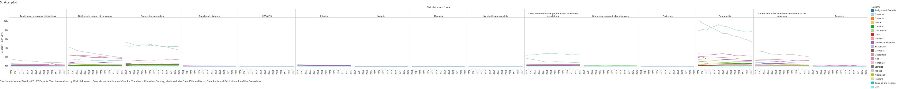

```{r, warning=FALSE, message=FALSE}
require("ggplot2")
require("ggthemes")
require("gplots")
require("grid")
require("RCurl")
require("reshape2")
require("tableplot")
require("tidyr")
require("dplyr")
require("jsonlite")
require("extrafont")
require("lubridate")
```

##Our Dataset
The dataset codes public opinion polls from Gallup's Most Important Problem Survey using the Policy Agendas Project's content coding scheme. The data is in the yearly format. All the entries are coded by the policy content of the poll responses, along with other variables of interest. This allows researchers to trace activity on a particular topic over time.

##Percentages of Major Topics during 1990-2010
This worksheet captures the aggregated proportions for each major category, on an
annual basis, for all of the polls contained in the working data set. These annualized proportions were constructed by normalizing the percentage of responses in every major topic (e.g. Macroeconomics) by the total percentage of responses in any given year

We made a bar chart visualization to show a more big picture view of the 20-year period of 1990-2010 (in 5-year increments). We inserted reference lines in each pane to show that average of that topic over that time period. (For this visualization, we took out the topics that had 0%.) We also colored the bars by Percentage so that it was easier to spot the trends. The biggest fluctuations in public opinion occured with the topics: Crime and Defense. The most constantnly significant topic was Macroeconomics, which is now the highest it has ever been.


Here is the SQL/R version of the same graph:

```{r fig.width=10, fig.height=15}
source("../03 R SQL Visualizations/BarChart.R",echo=TRUE)
```


##Percentages of Social Issue Major Topics 1960 - 2012
We made a scatterplot and a line graph portraying the Most Important Problem from Gallup's survey, specifically for topics related to social issues: Civil Rights, Crime, Education, Health, and Social Welfare.

The two visualizations portray several important trends: we can clearly see that Civil Rights was an extremely important issue up until 1975, when other issues began to take precedence.

Crime and Civil Rights both neared 0.2% 1965 - 1970, indicating a correlation. 

Education and Crime both showed a spike in importance near the year 2000, when Social Welfare was also on the rise. Both topics could have risen in importance due to people's assumption that an increase in education funding would, in turn, decrease Crime and would lessen the need for Social Welfare.

Finally, though one would think that Health would be closely correlated with these other Social topics, it actually shows a somewhat different trend: Health peaks as a topic in 1989, not correlated with the peak of any other topics, and it lessens in 1995, as soon as Crime skyrockets in importance. 

Towards the 2000s, Education, Health, Social Welfare, and Crime all experience a similar slight uptrend, while Civil Rights stays dormant. These trends altogether demonstrate the rising and falling of these different social issues' importance, and how they mostly fluctuate at similar times.

#####Most Important Problems in Social Issues 1960 - 2012


Here is the R/SQL version of this graph:
```{r fig.width=10, fig.height=6}
source("../03 R SQL Visualizations/Scatterplot.R",echo=TRUE )
```

##A Closer Look at the Great Recession

```{r fig.width=10, fig.height=6}
source("../03 R SQL Visualizations/DVTCrosstab.R",echo=TRUE)
```

This Visualization provides useful insight into the large change in public opinion after 2007 that likely occured due to the Great Recession. After 2007, public opinion is less and less concerned with defense and far more concerned with macroeconomics. The topic of macroeconomics became far more important to the public once the negative effects of the recession reached its low point in 2008 and 2009. Our KPI is calculated to determine how important a topic is based on the percentage for that year. Percentage less than 10 percent is low, between 10 and 25 percent is moderate, and above 25 percent is high.

##Data Blending
We created another data set called Policy Moods using a Python script that similarly represents the country's opinion on major topics. We then used Tableau to blend them with Year and Major topic, and produced a scatterplot just like our "Social Issues 1960 - 2012"" plot, but with this data blended with it.

###Most Important Problems in Social Issues 1960 - 2012


We also used SQL/R to blend the data sources and created the same scatterplot.

```{r fig.width=10, fig.height=6}
source("../03 R SQL Visualizations/Blending.R",echo=TRUE)
```
